

<button type="button" onclick="window.location.href='index.html';">Homepage</button>
<button type="button" onclick="alert('This is the first chapter!')">Previous</button>
<button type="button" onclick="window.location.href='ch3.html';">Next</button>

## Useful Notes and Equations
Before diving into the quesitons, some of the most handy notes and equations will be summarized in this section.

> **Definition 2.1.** The **configuration** of a robot is a complete specification of the position of every point of the robot. The minimum number n of **real-valued** coordinates needed to represent the configuration is the number of **degrees of freedom (dof)** of the robot. The n-dimensional space containing all possible configurations of the robot is called the **configuration space (C-space)**. The configuration of a robot is represented by a point in its C-space. 

It is worth noticing that a dof has to be real-valued coordinates. For instance, a discrete coordinate of a coin, $${head, tail}$$, cannot be a dof, because its range is not real.

### Tables
All pictures, tables, charts, unless noted otherwise, are taken from \[1].

### Equations
General idea about degree of freedom (DoF):
$$
\begin{align}
    \begin{split}
        \text{DoF} &= (\text{sum of freedoms of the points}) - (\text{No. of independent constraints})\\
        &= (\text{sum of freedoms of the bodies}) - (\text{No. of independent constraints})\\
    \end{split}
\end{align}
$$
#### Grübler's Formula
$$
\begin{align}
    \begin{split}
        \text{DoF} &= m(N-1)-\Sigma_{i=1}^{J}c_{i}\\
        &= m(N-1-J)+\Sigma_{i=1}^{J}f_{i}\\
        \text{where } m&=\text{DoF of a rigid body. For planar, m=3; for spatial, m=6}\\
        N&=\text{No. of links, always add 1 to account the ground}\\
        J&=\text{No. of joints}\\
        c_{i}&=\text{No. of constraints provided by ith joint}\\
        f_{i}&=\text{No. of DoF provided by ith joint}
    \end{split}
\end{align}
$$

N.B. that:
- Watch out for overlapping joints. If three links are connected to the same joint, then there are actually 2 joints!
- When dealing with constraints, try to model them as a special kind of joints:
  - A point constraint (e.g., the end-effector must pass through a given point in space) is equivalent to a SP joint;
  - A surface constraint (e.g., a block sliding on a surface) is equivalent to a RP2 joint;
  - If a mechanism is consisted of purely revolute joints and have their axes of rotation meeting at a single point, then the system is actually confined to move on a surface of sphere. In this case, choose $$m = 3$$.

***

## Textbook Exercises Attempts
> _**Exercise 2.1**_ Using the methods of Section 2.1 derive a formula, in terms of n, for the number of degrees of freedom of a rigid body in n-dimensional space. Indicate how many of these dof are translational and how many are rotational. Describe the topology of the C-space (e.g., for n = 2, the topology is R2 × S1).

Recall that in 3D we first choose an arbitrary point in space, which has a linear DoF of 3, then for all of the following rotational DoF, the preceding choice provides one constraint. Therefore in n=3 we have the topology $$\mathbb{R}^{3}\times \mathbb{S}^{2}\times \mathbb{S}^{1}$$.
Generalize this idea we have $$\mathbb{R}^{n}\times \mathbb{S}^{n-1}\times \mathbb{S}^{n-2}\times \text{...}\times \mathbb{S}^{1}$$.

>  _**Exercise 2.4**_ Assume each of your arms has n degrees of freedom. You are driving a car, your torso is stationary relative to the car (owing to a tight seatbelt!), and both hands are firmly grasping the wheel, so that your hands do not move relative to the wheel. How many degrees of freedom does your arms-plus-steering wheel system have? Explain your answer.

The wheel is a fixed rigid body in space, therefore it adds 6 constraints to the system. Then, each of your hand has a $$DoF = n-6 $$. Together you have $$DoF = 2n-12$$. However, if the wheel is free to rotate, then it adds 1 extra DoF to the system. In this case you have $$DoF = 2n-11$$.

> _**Exercise 2.5**_ Figure 2.15 shows a robot used for human arm rehabilitation. Determine the number of degrees of freedom of the chain formed by the human arm and the robot. 
 
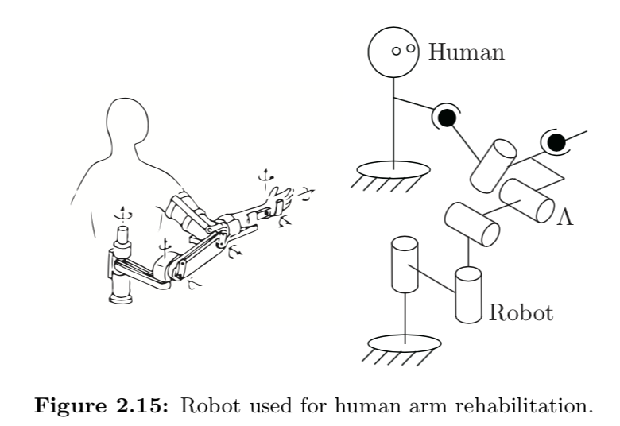

$$
\begin{align}
    \begin{split}
        m &= 6\\
        N &= 6(links) + 1(ground)=7\\
        J &= 5R + 2S=7\\
        \Sigma f_{i}&=5+2\cdot 3=11\\
        DoF&=m(N-1-J)+\Sigma f_{i}\\
        &= 6\cdot(7-1-7)+11\\
        &=5\\
    \end{split}
\end{align}
$$

>  _**Exercise 2.6**_ The mobile manipulator of Figure 2.16 consists of a 6R arm and multi-fingered hand mounted on a mobile base with a single wheel. You can think of the wheeled base as the same as the rolling coin in Figure 2.11 – the wheel (and base) can spin together about an axis perpendicular to the ground, and the wheel rolls without slipping. The base always remains horizontal. (Left unstated are the means to keep the base horizontal and to spin the wheel and base about an axis perpendicular to the ground.) 
> - (a) Ignoring the multi-fingered hand, describe the configuration space of the mobile manipulator.
> - (b) Now suppose that the robot hand rigidly grasps a refrigerator door handle and, with its wheel and base completely stationary, opens the door using only its arm. With the door open, how many degrees of freedom does the mechanism formed by the arm and open door have?
> - (c) A second identical mobile manipulator comes along, and after parking its mobile base, also rigidly grasps the refrigerator door handle. How many degrees of freedom does the mechanism formed by the two arms and the open refrigerator door have?
 
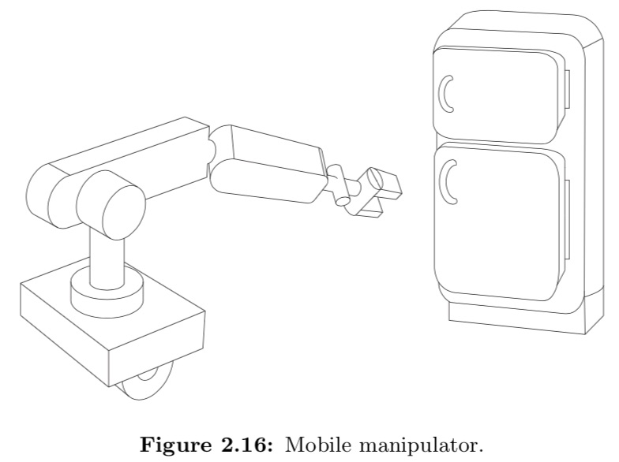

- (a) 
The base is kinematically equivalent to a rolling coin, then its C-space is $$\mathbb{R}^{2}\times \mathbb{T}^{2}$$. The C-space of a standard 6R robot is just plainly 6 rotational DoF, i.e. $$\mathbb{S}^{1}\times ...\times \mathbb{S}^{1}=\mathbb{T}^{6}$$. Altogether we have the system C-space as $$\mathbb{R}^{2}\times \mathbb{T}^{2}\times \mathbb{T}^{6}=\mathbb{R}^{2}\times \mathbb{T}^{8}$$.
- (b) $$ \begin{align}
    \begin{split}
        DoF &= 10(\text{total DoF})-4(\text{stationary base})\\
        &-6(\text{rigid body in space})+1(\text{door been free to rotate})\\
        &=1\\
    \end{split}
\end{align}
$$
- (c) $$DoF=2\cdot(10-4-6)+1=1$$

>  _**Exercise 2.7**_ Three identical SRS open-chain arms are grasping a common object, as shown in Figure 2.17.
> - (a) Find the number of degrees of freedom of this system.
> - (b) Suppose there are now a total of n such arms grasping the object. How many degrees of freedom does this system have?
> - (c) Suppose the spherical wrist joint in each of the n arms is now replaced by a universal joint. How many degrees of freedom does this system have?
 
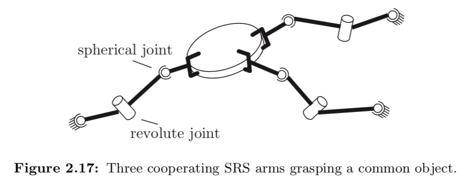
- (a) $$\begin{align}
    \begin{split}
        N &= 3\cdot(2)+1\\
        J &= 3\cdot(2S+R)\\
        \Sigma f_{i}&=3\cdot(2\cdot 3 +1)\\
        DoF&=6\cdot (8-1+9)+21\\
        &=9\\
    \end{split}
\end{align}
$$
- (b)$$\begin{align}
    \begin{split}
        N&=2n+2\\
        J&=n\cdot (2S+R)=3n\\
        \Sigma f_{i}&=7n\\
        DoF&=6\cdot (2n+2-1-3n)+7n\\
        &=6+n\\
    \end{split}
\end{align}
$$
- (c) S=>U, 3=>2
$$
\begin{align}
    \begin{split}
        \Sigma f_{i}&=n\cdot (U+S+R)=6n\\
        DoF&=6\cdot (2n+2-1-3n)+5n\\
        &=6\\
    \end{split}
\end{align}
$$

>  _**Exercise 2.8**_ Consider a spatial parallel mechanism consisting of a moving plate connected to a fixed plate by n identical legs. For the moving plate to have six degrees of freedom, how many degrees of freedom should each leg have, as a function of n? For example, if n = 3 then the moving plate and fixed plate are connected by three legs; how many degrees of freedom should each leg have for the moving plate to move with six degrees of freedom? Solve for arbitrary n.

$$\begin{align}
    \begin{split}
        N &= 1(moving plate) + 1(fix plate/ground)\\
        J &= n\\
        \text{Let x be the No. of DoF of one leg.}\\
        \text{Then, }\Sigma f_{i}&=x\cdot n\\
        \text{DoF}&=6\cdot (2-1-n)+x\cdot n\\
        &=6\\
    \end{split}
\end{align}
$$
It seems that the DoF is a constant.

>  _**Exercise 2.9**_ Use the planar version of Grübler’s formula to determine the number of degrees of freedom of the mechanisms shown in Figure 2.18. Comment on whether your results agree with your intuition about the possible motions of these mechanisms.
 
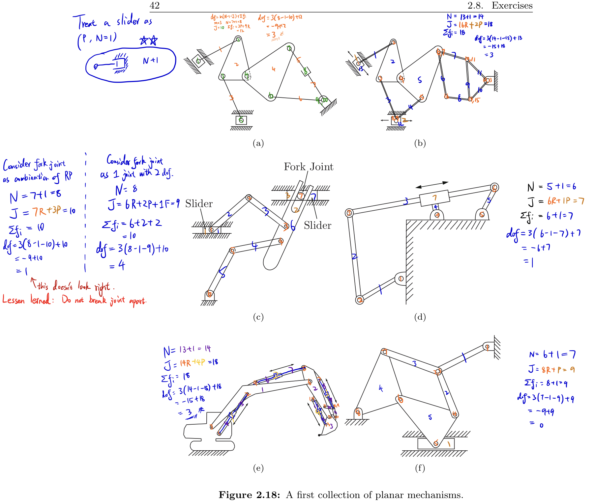

>  _**Exercise 2.10**_ Use the planar version of Grübler’s formula to determine the number of degrees of freedom of the mechanisms shown in Figure 2.19. Comment on whether your results agree with your intuition about the possible motions of these mechanisms.

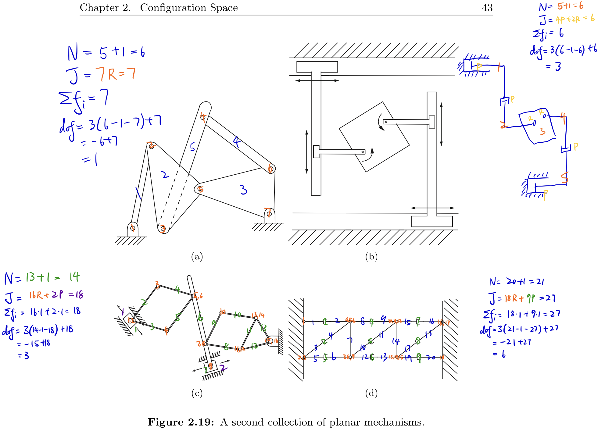

> _**Exercise 2.11**_ Use the spatial version of Grübler’s formula to determine the number of degrees of freedom of the mechanisms shown in Figure 2.20. Comment on whether your results agree with your intuition about the possible motions of these mechanisms.

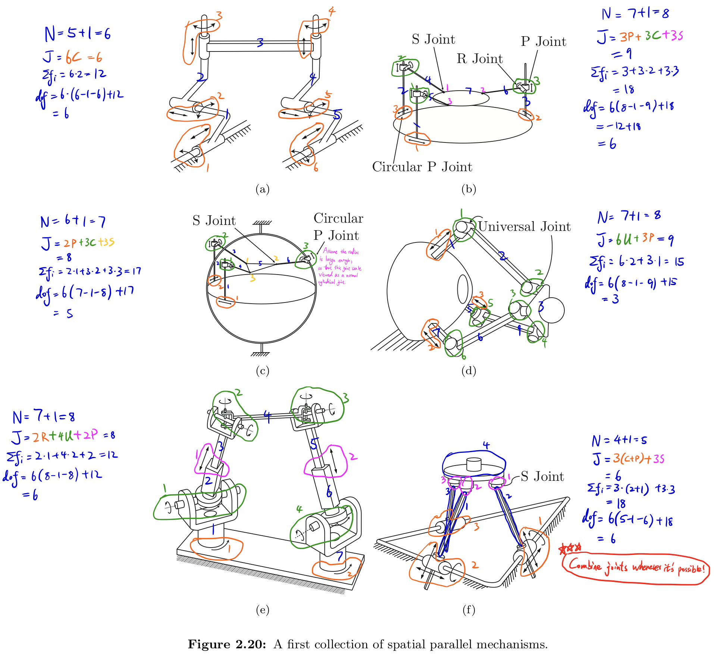

> _**Exercise 2.12**_ Use the spatial version of Grübler’s formula to determine the number of degrees of freedom of the mechanisms shown in Figure 2.21. Comment on whether your results agree with your intuition about the possible motions of these mechanisms.

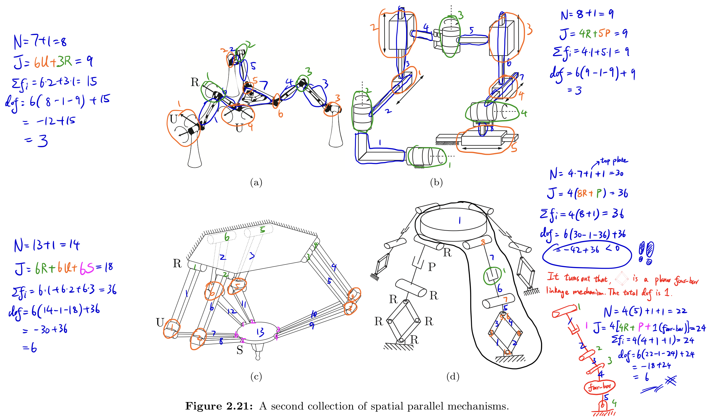

For part (d), The RRRR mechanism at the bottom is called a scissor linkage (or lazy Tongs), which is a kind of planar four-bar linkage. Such structure provides 1 DoF.

> _**Exercise 2.13**_ In the parallel mechanism shown in Figure 2.22, six legs of identical length are connected to a fixed and moving platform via spherical joints. Determine the number of degrees of freedom of this mechanism using Grübler’s formula. Illustrate all possible motions of the upper platform.

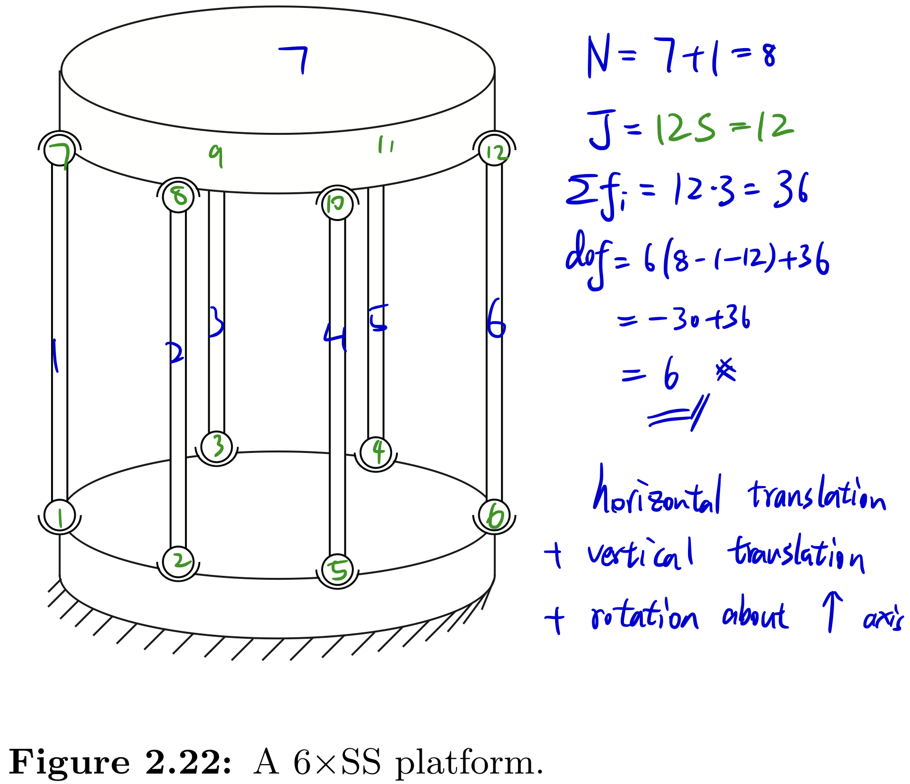

> _**Exercise 2.14**_ The 3×UPU platform of Figure 2.23 consists of two platforms – the lower one stationary, the upper one mobile–connected by three UPU legs.
> - (a) Using the spatial version of Grübler’s formula, verify that it has three degrees of freedom.
> - (b) Construct a physical model of the 3×UPU platform to see if it indeed has three degrees of freedom. In particular, lock the three P joints in place; does the robot become a rigid structure as predicted by Grübler’s formula, or does it move?

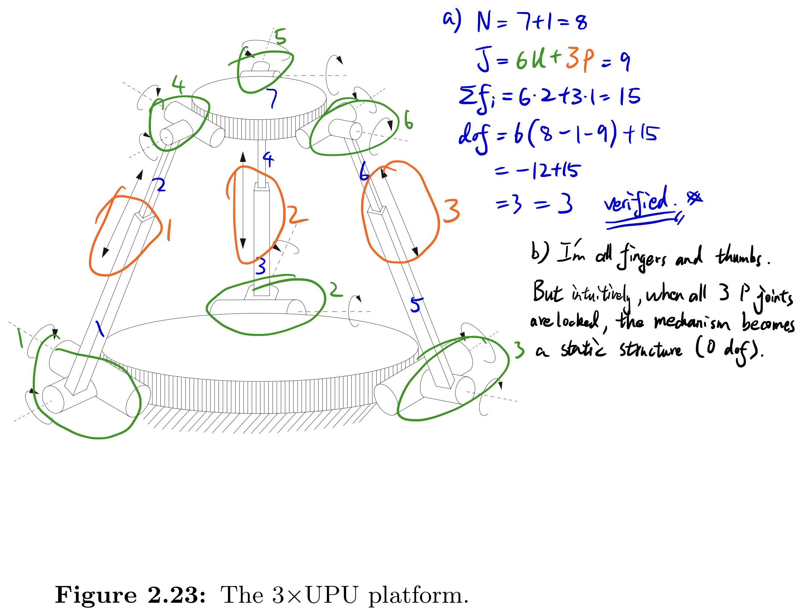

> _**Exercise 2.15**_ The mechanisms of Figures 2.24(a) and 2.24(b).
> - (a) The mechanism of Figure 2.24(a) consists of six identical squares arranged in a single closed loop, connected by revolute joints. The bottom square is fixed to ground. Determine the number of degrees of freedom using Grübler’s formula.
> - (b) The mechanism of Figure 2.24(b) also consists of six identical squares connected by revolute joints, but arranged differently (as shown). Determine the number of degrees of freedom using Grübler’s formula. Does your result agree with your intuition about the possible motions of this mechanism?

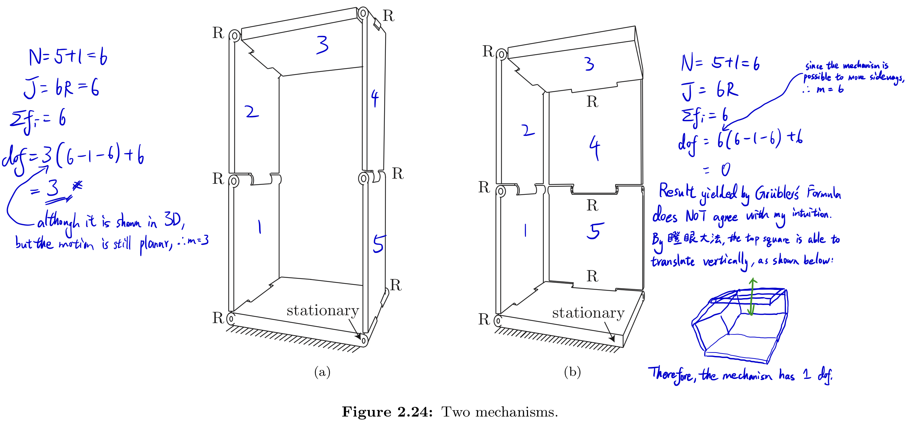

> _**Exercise 2.16**_ Figure 2.25 shows a spherical four-bar linkage, in which four links (one of the links is the ground link) are connected by four revolute joints to form a single-loop closed chain. The four revolute joints are arranged so that they lie on a sphere such that their joint axes intersect at a common point.
> - (a) Use Grübler’s formula to find the number of degrees of freedom. Justify your choice of formula.
> - (b) Describe the configuration space.
> - (c) Assuming that a reference frame is attached to the center link, describe its workspace.

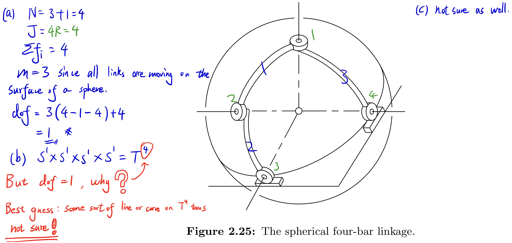

> _**Exercise 2.17**_ Figure 2.26 shows a parallel robot used for surgical applications. As shown in Figure 2.26(a), leg A is an RRRP chain, while legs B and C are RRRUR chains. A surgical tool is rigidly attached to the end-effector.
> - (a) Use Grübler’s formula to find the number of degrees of freedom of the mechanism in Figure 2.26(a).
> - (b) Now suppose that the surgical tool must always pass through point A in Figure 2.26(a). How many degrees of freedom does the manipulator have?
> - (c) Legs A, B, and C are now replaced by three identical RRRR legs as shown in Figure 2.26(b). Furthermore, the axes of all R joints pass through point A. Use Gru ̈bler’s formula to derive the number of degrees of freedom of this mechanism.

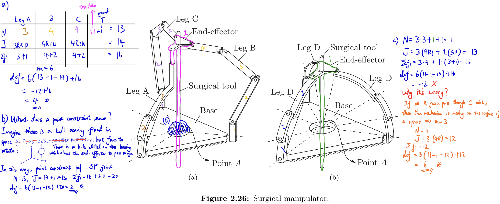

> _**Exercise 2.18**_ Figure 2.27 shows a 3×PUP platform, in which three identical PUP legs connect a fixed base to a moving platform. The P joints on both the fixed base and moving platform are arranged symmetrically. Use Grbler’s formula to find the number of degrees of freedom. Does your answer agree with your intuition about this mechanism? If not, try to explain any discrepancies without resorting to a detailed kinematic analysis.

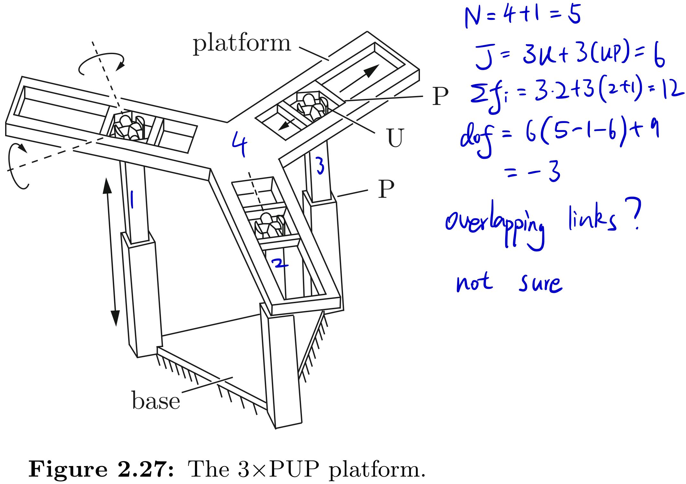

> _**Exercise 2.19**_ The dual-arm robot of Figure 2.28 is rigidly grasping a box. The box can only slide on the table; the bottom face of the box must always be in contact with the table. How many degrees of freedom does this system have?

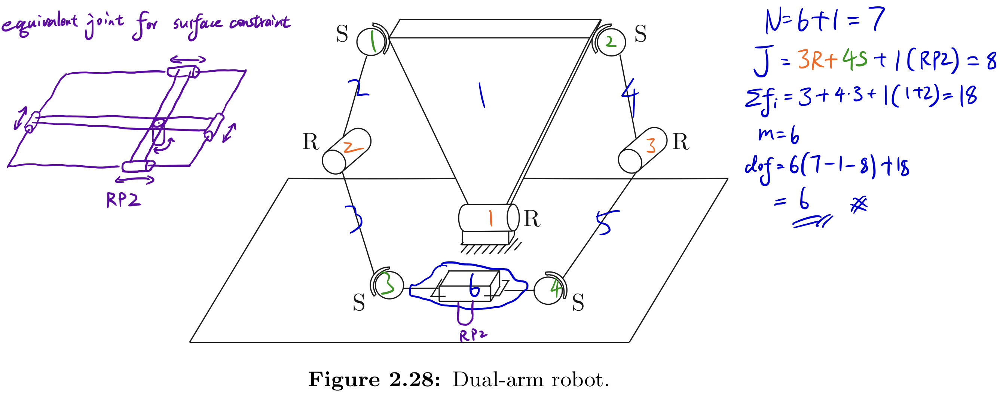

> _**Exercise 2.20**_ The dragonfly robot of Figure 2.29 has a body, four legs, and four wings as shown. Each leg is connected to each adjacent leg by a USP linkage. Use Grübler’s formula to answer the following questions.
> - (a) Suppose the body is fixed and only the legs and wings can move. How many degrees of freedom does the robot have?
> - (b) Now suppose the robot is flying in the air. How many degrees of freedom does the robot have?
> - (c) Now suppose the robot is standing with all four feet in contact with the ground. Assume that the ground is uneven and that each foot–ground contact can be modeled as a point contact with no slip. How many degrees of freedom does the robot have? Explain your answer.

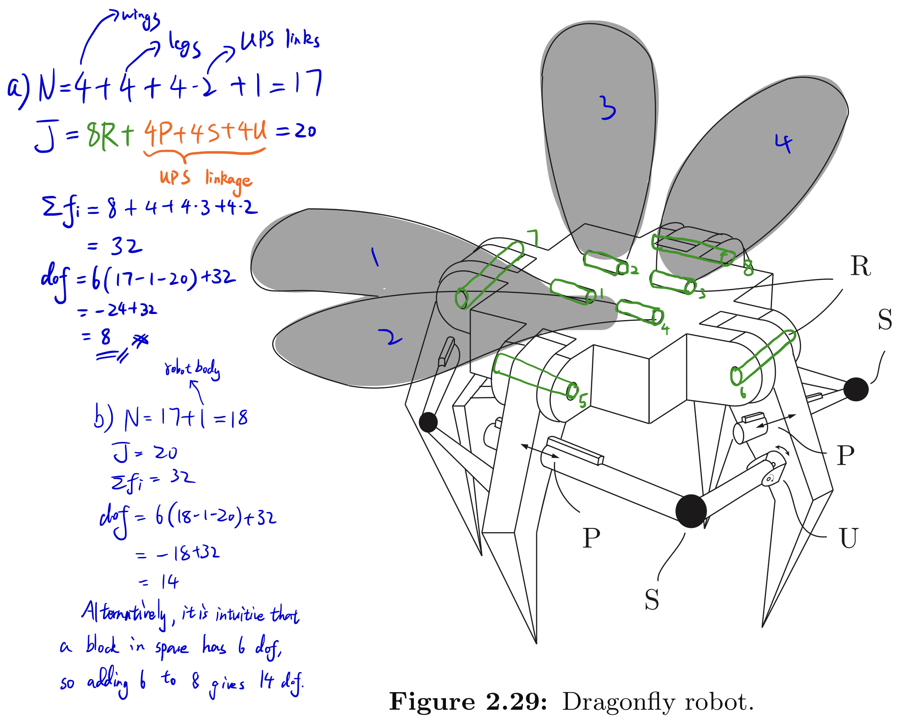
- (c) The legs on the ground can be viewed as a point constraint that does not allow translation, therefore it can be modeled as merely a S joint. In doing so, by Grübler's formula we have:
$$
\begin{align*}
    \begin{split}
        N&=18\\
        J&=20+4S=24\\
        \Sigma f_{i}&=32+4\cdot (3)=44\\
        DoF &= 6\cdot (18-1-24)+44\\
        &=2\\
    \end{split}
\end{align*}
$$
It should be pointed out that the wings of the Dragonfly are free to move. This means that the wings have 4 DoF, while the entire system only has 2. It might imply that the rest of the system has negative DoF. I am not sure whether this is showing that the existence of dependent joints (in this case the Grübler's formula will give negative DoF), or it is showing that there are extra constraints applied to the system.

$$\begin{align*}
    \begin{split}
        \text{Valete discipulae et discipuli}
    \end{split}
\end{align*}
$$

***

## References

[1] Modern Robotics Textbook.

<button type="button" onclick="window.location.href='#top';">Back To Top</button>

