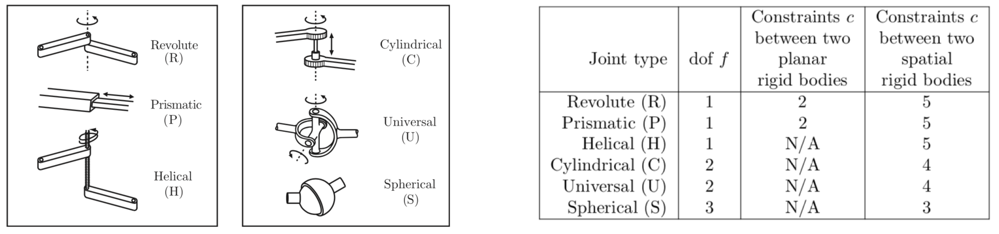

<button type="button" onclick="window.location.href='index.html';">Homepage</button>
<button type="button" onclick="alert('This is the first chapter!')">Previous</button>
<button type="button" onclick="window.location.href='ch3.html';">Next</button>

## Useful Notes and Equations
Before diving into the quesitons, some of the most handy notes and equations will be summarized in this section.
### Tables
All pictures, tables, charts, unless noted otherwise, are taken from \[1].

### Equations
General idea about degree of freedom (DoF):
$$
\begin{align}
    \begin{split}
        \text{DoF} &= (\text{sum of freedoms of the points}) - (\text{No. of independent constraints})\\
        &= (\text{sum of freedoms of the bodies}) - (\text{No. of independent constraints})\\
    \end{split}
\end{align}
$$
#### Grübler's Formula
$$
\begin{align}
    \begin{split}
        \text{DoF} &= m(N-1)-\sigma_{i=1}^{J}c_{i}\\
        &= m(N-1-J)+\sigma_{i=1}^{J}f_{i}\\
        \text{where } m&=\text{DoF of a rigid body. For planar, m=3; for spatial, m=6}\\
        N&=\text{No. of links, always add 1 to count for the ground}\\
        J&=\text{No. of joints}\\
        c_{i}&=\text{No. of constraints provided by ith joint}\\
        f_{i}&=\text{No. of DoF provided by ith joint}
    \end{split}
\end{align}
$$

***
## Textbook Exercises and my attempts
> Exercise 2.1 Using the methods of Section 2.1 derive a formula, in terms of n, for the number of degrees of freedom of a rigid body in n-dimensional space. Indicate how many of these dof are translational and how many are rotational. Describe the topology of the C-space (e.g., for n = 2, the topology is R2 × S1).
Recall that in 3D we first choose an arbitrary point in space, which has a linear DoF of 3, then for all of the following rotational DoF, the preceding choice provides one constraint. Therefore in n=3 we have the topology $$\R^{3}\times \mathbb{S}^{2}\times \mathbb{S}^{1}$$.
Generalize this idea we have $$\R^{n}\times \mathbb{S}^{n-1}\times \mathbb{S}^{n-2}\times \text{...}\times \mathbb{S}^{1}$$.

***

## References

[1] Modern Robotics Textbook.

<button type="button" onclick="window.location.href='#top';">Back To Top</button>

